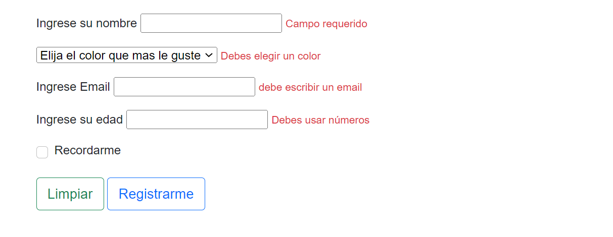
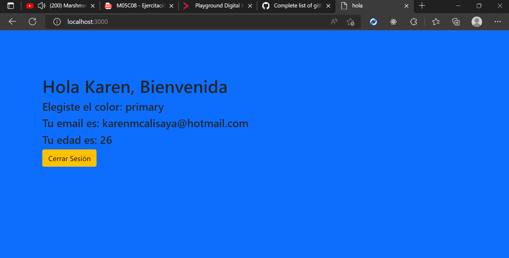

### Session y Cookies 🍪🍪
#### Session en sí es una variable "global" disponible para toda la aplicación. Esta nos permite almacenar información del lado del servidor durante la visita del usuario a nuestro sitio y compartirla con las vistas.
#### Entonces, ¿que son las cookies? Es un archivo que se guarda del lado del cliente(en el navegador). Guarda información no sensible. Las cookies las podemos configurar con un tiempo de vida, es decir cuando expire el tiempo de esa cookie y no cuando el usuario cierre el navegador. ✨✨
#### En esta práctica usé express validator para validar los datos que nos llegan del usuario y apliqué session y cookies.

